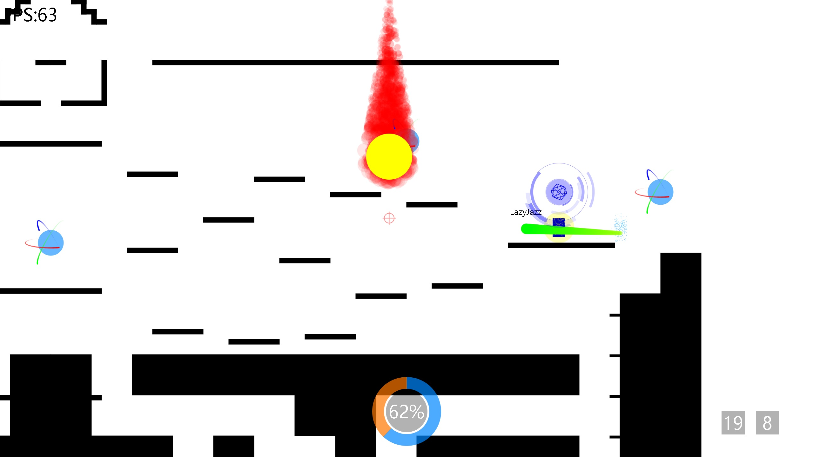

# Game04 简易说明

作者：LazyJazz

这是一个 “抄袭” 守望先锋的 2D 射击游戏

</img>

## 快速开始游戏！

在第一个空栏处填写角色名

### 创建服务端

在填写完角色名之后，点击 Create Server

### 加入服务端

在填写完角色名之后

在第二个空栏处填写服务端 IP 地址

然后点击 Join Server，如网络连接正常且服务端已开启，应成功跳转到房间页面

### 房间页面

玩家可以点击左上角 Change Side 以更换阵营，

服务端玩家可以点击 Start 以开始游戏。

()[]

### 角色类型

目前只开发了两种角色，游戏开始时随机分配给每名玩家一种角色类型，死亡复活可重新随机（可能随机到和死亡前一样的角色类型）

#### 飞行兵

##### 左键 - 火箭炮

打出一发火箭炮，可以命中敌人或墙壁，造成范围伤害，可以伤害到自己。 与敌方火箭炮对撞也会爆炸。

##### Shift - 冲刺

向光标方向冲刺一段距离，并对冲刺过程中遇到的敌人产生伤害

##### 右键 - 陨石

在光标处召唤一颗陨石，所有碰到陨石的敌人都会被秒杀

##### 被动 - 飞行

按住 W 键可以进行持续飞行，目前没有时间限制

##### Q键 - 天降正义（终极技能）

向光标方向连续发射大量火箭炮，技能过程中角色不受重力影响。

#### 刺客

##### 左键 - 机枪

向光标方向打出高速子弹，杀伤被击中的敌人

##### Shift - 隐身

将自己隐身，使敌人无法看到你，隐身期间移动速度和跳跃高度大幅提高

##### 右键 - 引力场

向光标方向射出一个引力场，引力场会前进一小段距离并停止，引力场会将所有途径的火箭炮吸引住，并抵挡所有其作用范围内的敌方子弹。在引力场消失时，其作用范围所有火箭炮会改变方向，向引力场使用者光标处飞去。

##### 被动 - 献祭

所有一定范围内的敌人都会受到持续的灼烧伤害，有粒子效果提示

##### Q键 - 火力全开（终极技能）

大幅度降低左键攻击的子弹间隔，打出密集的弹幕，造成高额伤害

